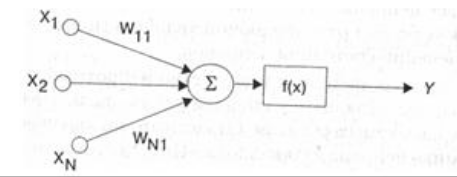
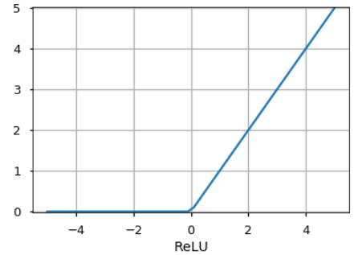

<!-- TABLE OF CONTENTS -->

CNN - cvertochnaya neuro network

  <h1>Содержание</h1>
  

<ol>
  <li><a href="#1">Представление правил в продукционном программировании</a></li>
  <li><a href="#2">Семантические и ассоциативные сети</a></li>
  <li><a href="#3">Фреймовая модель представления знаний</a></li>
  <li><a href="#4">Обучение сети по методу обратного распространения ошибки</a></li>
  <li><a href="#5">Понятие, и особенности интеллектуальных информационных систем</a></li>
  <li><a href="#6">Системы, основанные на знаниях</a></li>
  <li><a href="#7">Модели представления знаний</a></li>
  <li><a href="#8">Продукционная модель (правила продукций)</a></li>
  <li><a href="#9">Представление и обработка непределенности в продукционных системах</a></li>
  <li><a href="#10">Байесова модель</a></li>
  <li><a href="#11">Сетевые модели и графы</a></li>
  <li><a href="#12">Рейтинговая модель</a></li>
  <li><a href="#13">Нечеткая модель</a></li>
  <li><a href="#14">Фреймы и объективно-ориентирована представление знаний</a></li>
  <li><a href="#15"> Ситуационный подход в представлении знаний и выводе решений</a></li>
  <li><a href="#16">Системы интеллектуального анализа данных. Извлечение знаний из данных</a></li>
  <li><a href="#17">Архитектура многослойных нейронных сетей</a></li>
  <li><a href="#18">Активация нейронной сети посредством прямого распространения</a></li>
  <li><a href="#19">Распараллеливание процесса обучения нейронных сетей с помощью TensorFlow</a></li>
  <a href="#20.0">Сверточные нейронные сети</a>
  <li><a href="#20">Классификация изображений с помощью глубоких сверточных нейронных сетей</a></li>
  <li><a href="#21">Строительные блоки сверточных нейронных сетей</a></li>
  <li><a href="#22">Понятие сверточных нейронных сетей</a></li>
  <li><a href="#23">Выполнение дискретных сверток в сверточной нейронной сети</a></li>
  <li><a href="#24">Работа с множественными входными или цветовыми каналами в сверточной нейронной сети</a></li>
  <li><a href="#25">Архитектура многослойной сверточной нейронной сети</a></li>
  
   
  <a href="#ggd">Если не знаете ответ на вопрос, то это должно вас выручить</a>
</ol>

 

##

<h2 id="1"> 1. Представление правил в продукционном программировании </h2>

Продукционная МПЗ (МПЗ - модель представления знаний(или правил))

В основе продукционной модели представления знаний находится конструктивная часть, продукция(правило:

> IF <условие>, THEN <действие>

Продукция состоит из двух частей: условие — антецендент, действие — консеквент. Условия можно сочетать с помощью логических функций AND, OR.
Антецеденты и консеквенты составленных правил формируются из атрибутов и значений.
Пример:  

> IF температура реактора подымается THEN добавить стержни в реактор

В базе данных продукционной системы хранятся правила, истинность которых установлена к за ранее при решении определенной задачи.  
Правило срабатывает, если при сопоставлении фактов, содержащихся в базе данных с антецедентом правила, которое подвергается проверке, имеет место совпадение. Результат работы правила заносится в базу данных.

<a href="#readme-top">К содержанию</a>

##

<h2 id="2"> 2. Семантические и ассоциативные сети</h2>

<h4>Семанти́ческая сеть</h4>

<b>Семанти́ческая сеть</b> — информационная модель предметной области, имеет вид ориентированного графа.
Вершины графа соответствуют объектам предметной области, а дуги (рёбра) задают отношения между ними.
Объектами могут быть: <u>понятия, события, свойства, процессы</u>. Таким образом, <b>семантическая сеть</b> — это один из способов представления знаний.

В названии соединены термины из двух наук:

1. <b>Семантика</b> в языкознании изучает смысл единиц языка, а сеть в математике представляет собой разновидность графа — набора вершин, соединённых дугами (рёбрами), которым присвоено некоторое число. В семантической сети роль вершин выполняют понятия базы знаний
2. <b>Дуги</b> (причем направленные) задают отношения между ними. Таким образом, семантическая сеть отражает семантику предметной области в виде понятий и отношений.

Неправильно приравнивать друг другу понятия «Семантическая сеть» и «Семантическая паутина». Хотя эти понятия не эквивалентны, тем не менее, они связаны.

- <h5>Структура</h5>
    Математика позволяет описать большинство явлений в окружающем мире в виде логических высказываний. Семантические сети возникли как попытка визуализации математических формул. Основным представлением для семантической сети является граф.
    Однако не стоит забывать, что за графическим изображением непременно стоит строгая математическая запись и что обе эти формы отображают одно и то же.

- <h5>Графическое представление</h5>
    Основной формой представления семантической сети является граф.
    Понятия семантической сети записываются в овалах или прямоугольниках и соединяются стрелками с подписями — дугами.
    Это наиболее удобно воспринимаемая человеком форма. Её недостатки проявляются,
    когда мы начинаем строить более сложные сети или пытаемся учесть особенности естественного языка. Схемы семантических сетей,
    на которых указаны направления навигационных отношений, называют картами знаний, а их совокупность,
    позволяющая охватить большие участки семантической сети, атласом знания.

- <h5>Математическая запись</h5>
    В математике граф представляется множеством вершин V и множеством отношений между ними E.
    Используя аппарат математической логики, приходим к выводу,
    что каждая вершина соответствует элементу предметного множества, а дуга — предикату.

- <h5>Лингвистическая запись</h5>
    В лингвистике отношения фиксируются в словарях и в тезаурусах. В словарях в определениях через род и видовое отличие родовое понятие занимает определённое место.
    В тезаурусах в статье каждого термина могут быть указаны все возможные его связи с другими родственными по теме терминами.
    От таких тезаурусов необходимо отличать тезаурусы информационно-поисковые с перечнями ключевых слов в статьях, которые предназначены для работы дескрипторных поисковых систем.

<h4>Ассоциативная сеть</h4>
<b>Ассоциативная сеть</b> - основное отличие ассоциативной сети от семантической в том, что мы указываем не смысл (сущность) связи между объектами, а просто говорим об их ассоциировании,
о силе, уровне ассоциаций. Под ассоциацией понимается семантическая репрезентативность в смысле.
При этом надо различать индивидуальные, настраиваемые модели ассоциаций (и их объединение в групповые) и усредненные (статистические),
такие как, например, статистики запросов в поисковых машинах. Кроме этого, следует различать модели ассоциаций непосредственно субъекта и модель передачи знаний между субъектами.

<a href="#readme-top">К содержанию</a>

##

<h2 id="3"> 3. Фреймовая модель представления знаний</h2>

<b>Фреймовая модель представления знаний</b> – была предложена М.Минским в 1979 г. как структура знаний для восприятия пространственных сцен.
Фреймом называется также и формализованная модель для отобра­же­ния образа.

В качестве идентификатора фрейму присваивается имя фрей­ма. Это имя должно быть единственным во всей фреймовой системе.

Фрейм имеет определенную внутреннюю структуру, состоящую из мно­­жества элементов, называемых слотами, которым также присва­и­ва­ют­ся имена.
За слотами следуют шпации, в которые помещают данные, представляющие текущие значения слотов.
Каждый слот в свою очередь представляется опре­де­ленной струк­турой данных.
В значение слота подставляется конкретная инфор­ма­ция, относящаяся к объекту, описываемому этим фреймом.

Модель фрейма является достаточно универсальной, поскольку позволяет отобразить все многообразие знаний о мире:

- через фреймы-структуры, для обозначения объектов и понятий (заем, залог, вексель);
- через фреймы-роли (менеджер, кассир, клиент);
- через фреймы-сценарии (банкротство, собрание акционеров, празднование именин);
- через фреймы-ситуации (тревога, авария, рабочий режим устройства) и др.

<u>Основным преимуществом фреймов</u> как модели пред­став­ления знаний является то, что она отражает концептуальную основу ор­ганизации па­мяти чело­века, а также ее гибкость и наглядность. Наиболее ярко дос­то­ин­ства фреймовых систем представления знаний проявляются в том слу­чае, если родовидовые связи изменяются нечасто и предметная область насчитывает немного исключений. Во фреймовых системах данные о ро­до­­видовых связях хранятся явно, как и знания других типов. Значения сло­тов представляются в системе в единственном экземпляре, поскольку вклю­чаются только в один фрейм, описывающий наиболее понятия из всех тех, которые содержит слот с данным именем. Такое свойство систем фрей­мов обеспечивает экономное размещение базы знаний в памяти ком­пью­тера. Еще одно достоинство фреймов состоит в том, что значение лю­бо­го слота может быть вычислено с помощью соответствующих процедур или найдено эвристическими методами. То есть фреймы позволяют ма­ни­пу­лировать как декларативными, так и процедурными знаниями.

<u>К недостаткам фреймовых систем</u> относят их относительно высокую сложность, что проявляется в снижении скорости работы механизма вы­во­да и увеличения трудоемкости внесения изменений в родовую иерар­хию. Поэтому при разработке фреймовых систем уделяют наглядным способам отображения и эффективным средствам редактирования фреймовых структур.

<a href="#readme-top">К содержанию</a>

##

<h2 id="4"> 4. Обучение сети по методу обратного распространения ошибки</h2>

<b>Алгоритм обратного распространения ошибки</b> — популярный алгоритм обучения нейронных сетей прямого распространения (многослойных персептронов). Относится к методам обучения с учителем, поэтому требует, чтобы в обучающих примерах были заданы целевые значения. Также является одним из наиболее известных алгоритмов машинного обучения

<b>Персептрон</b> - математическая или компьютерная модель восприятия информации мозгом

Основная идея этого метода состоит в распространении сигналов ошибки от выходов сети к её входам, в направлении обратном прямому распространению сигналов в обычном режиме работы. Барцев и Охонин предложили обобщающий метод («принцип двойственности»), применимый к более широкому классу систем, включая системы с запаздыванием, распределённые системы.

Вот кароче формула делайте с ней че хотите

  
 

для вычисления величин коррекции весов нейронов в ее скрытых слоях, где
k — число выходных нейронов сети,
y — целевое значение,
y′— фактическое выходное значение. Алгоритм является итеративным и использует принцип обучения «по шагам» (обучение в режиме on-line), когда веса нейронов сети корректируются после подачи на ее вход одного обучающего примера.

На каждой итерации происходит два прохода сети — прямой и обратный. На прямом входной вектор распространяется от входов сети к ее выходам и формирует некоторый выходной вектор, соответствующий текущему (фактическому) состоянию весов. Затем вычисляется ошибка нейронной сети как разность между фактическим и целевым значениями. На обратном проходе эта ошибка распространяется от выхода сети к ее входам, и производится коррекция весов нейронов в соответствии с правилом:

Таким образом, алгоритм использует так называемый стохастический градиентный спуск, «продвигаясь» в многомерном пространстве весов в направлении антиградиента с целью достичь минимума функции ошибки.

На практике обучение продолжают не до точной настройки сети на минимум функции ошибки, а до тех пор, пока не будет достигнуто достаточно точное его приближение. Это позволит, с одной стороны, уменьшить число итераций обучения, а с другой — избежать переобучения сети.

<a href="#readme-top">К содержанию</a>

##

<h2 id="5"> 5. Понятие и особенности интеллектуальных информационных систем</h2>

<b>Интеллектуальная информационная система</b> (ИИС) - комплекс программных, лингвистических и логико-математических средств для реализации основной задачи – осуществления поддержки деятельности человека и поиска информации в режиме продвинутого диалога на естественном языке. ИИС являются разновидностью интеллектуальной системы, а также одним из видов информационных систем.

Для интеллектуальных информационных систем характерны
следующие особенности:

- развитые коммуникативные способности;
- умение решать сложные плохо формализуемые задачи;
- способность к самообучению;
- адаптивность.

Коммуникативные способности ИС характеризуют способ
взаимодействия (интерфейса) конечного пользователя с системой, в
частности возможность формулирования произвольного запроса в
диалоге с ИС на языке, максимально приближенном к естественному.

<a href="#readme-top">К содержанию</a>

##

<h2 id="6"> 6. Системы основанные на знаниях </h2>

В литературе существуют разные определения термина <b>знание</b>. Следует иметь ввиду, что речь идет не о знаниях вообще, а о том, что понимается под этим термином именно в компьютерных системах, в ИИС.

Так, для знаний дается следующее определение:

<b>Знания</b> – это закономерности предметной области (принципы, связи, законы), полученные в результате практической деятельности и профессионального опыта, позволяющие специалистам ставить и решать задачи в этой области.

Часто определяют понятие <u>знания</u> отличиями от понятия <u>данные</u>.

<b>Данные</b> – это отдельные факты, характеризующие объекты, процессы и явления предметной области, а также их свойства.

Сравнение функций данных и знаний позволяет дать следующее, достаточно общее определение.

<b>Знания</b> (в компьютерной системе) – закодированные некоторым образом сведения об объектах предметной области, их взаимосвязях и особенностях поведения, а также о способах решения задач. Эти сведения в условиях, характеризуемых некоторыми данными, служат инструментом решения задач.

То есть можно сказать, что <u>знания</u> – это инструмент решения задач, а <u>данные</u> - информационное обеспечение такого решения.

<b>Знания</b> – это высокоструктурированные сведения, самодостаточные, не требующие дополнительных программ для интерпретации. Знания обладают семантикой (смыслом) и прагматикой (руководством к действию) в контексте определенной задачи. Данные – это конкретные значения атрибутов объектов, процессов или отношений (констант и переменных, числовых и символьных).

Так, в компьютере могут присутствовать знания о временах года, о том, когда в данном городе летом начинает темнеть, о том, какие районы города и в какое время считаются небезопасными и т.п. Конкретная ситуация может характеризоваться такими данными, как время года, время суток, место нахождения человека. «Наложение» этих данных на знания может привести к суждению о том, что в данном месте в данное время находиться этому человеку опасно (и насколько, опасно). В более сложном случае вывод об опасности нахождения человека в сложившейся ситуации может продолжиться поиском и предложением вариантов действий для этого человека, в том числе, с учетом его цели и его предпочтений.

Классификация знаний выполняется по разным признакам. По характеру и трудности выявления и последующей формализации знаний в компьютере их разделяют на два типа:

- знания 1-го рода (называют еще артикулируемые). Это знания, которые хорошо представляются в виде текстов. Они, соответственно, воплощены в разных учебниках, документах, технологических картах, рекомендациях и т.п.;

- знания 2-го рода (неартикулируемые). Эти знания отражают индивидуальный опыт решения профессиональных задач, они трудно формализуются и, как правило, непредставимы или труднопредставимы с помощью обычных текстов. Эти знания представляются в ИИС с помощью специальных моделей представления знаний, позволяющих не только закодировать их в памяти компьютера. Но и использовать для имитации рассуждения и автоматизированном выводе решений.

По степени объективности знаний они разделяются на глубинные (общепризнанные, отражающие объективные закономерности) и эмпирические, опытные, которые отражают опыт отдельного человека или коллективов людей.

В зависимости от того, что характеризуют знания, они разделяются на фактуальные (декларативные, предметные знания) и процедурные (операционные). Первые – это описания фактов и явлений, а также взаимосвязей между ними. Вторые есть описания способов действий, которые возможно при манипулировании фактами для достижения поставленных целей. Если фактуальные знания отвечают на вопрос «Что (делать)?», то процедурные – на вопрос «Как (как делать)?»

В ИИС различают также знания коллективные и знания индивидуальные. Индивидуальные знания имеют особое значение в экспертных системах, в системах принятия решений, имитирующих рассуждения эксперта в ходе решения задач и рассуждения ЛПР в ходе анализа и выбора альтернатив.

При представлении знаний в ИИС выделяют также термин метазнания – это знания о знаниях, о том, как взаимосвязаны отдельные сегменты знаний между собой, о порядке их использования в процессе вывода решений.

Появление систем, основанных на знаниях (СОЗ), стало важным событием в развитии искусственного интеллекта. Основанные на экспертных знаниях системы (экспертные системы), явились первым примером того, что ИИ – это не только исследования или компьютерные игры, но это и реальный бизнес, это системы, которые могут приносить их пользователям дополнительные доходы, исчисляемые миллионами.

<a href="#readme-top">К содержанию</a>

##

<h2 id="7"> 7. Модели представления знаний </h2>

Распространены четыре основных МПЗ:

- Продукционная МПЗ
- Семантическая сеть МПЗ
- Фреймовая МПЗ
- Формально логическая МПЗ

<h5>1. Продукционная МПЗ</h3>

В основе продукционной модели представления знаний находится конструктивная часть, продукция(правило):

> IF <условие>, THEN <действие>

Продукция состоит из двух частей: условие — антецендент, действие — консеквент. Условия можно сочетать с помощью логических функций AND, OR.

Антецеденты и консеквенты составленных правил формируются из атрибутов и значений.

Пример:

> IF температура реактора подымается THEN добавить стержни в реактор

В базе данных продукционной системы хранятся правила, истинность которых установлена к за ранее при решении определенной задачи. Правило срабатывает, если при сопоставлении фактов, содержащихся в базе данных с антецедентом правила, которое подвергается проверке, имеет место совпадение. Результат работы правила заносится в базу данных.

<h5>2. Семантическая сеть МПЗ</h5>

В основе продукционной модели лежит ориентированный граф.  
Вершины графа — понятия, дуги — отношения между понятиями.

Особенностью является наличие трех типов отношений:

- класс — подкласс
- свойство — значение
- пример элемента класса

По количеству типов отношений выделяют однородные и неоднородные семантические сети. Однородные имею один тип отношения между всеми понятиями, следовательно, не однородные имею множество типов отношений.

Все типы отношений:

- часть — целое
- класс — подкласс
- элемент — количество
- атрибутивный
- логический
- лингвистический

<h5>3. Фреймовая МПЗ</h5>

Предложил Марвин Мински в 1970 году. В основе фреймовой модели МПЗ лежит фрейм. <b>Фрейм</b> — это образ, рамка, шаблон, которая описывает объект предметной области, с помощью слотов. <b>Слот</b> — это атрибут объекта. Слот имеет имя, значение, тип хранимых данных, демон. <b>Демон</b> — процедура автоматически выполняющаяся при определенных условиях. Имя фрейма должно быть уникальным в пределах одной фреймовой модели. Имя слота должно быть уникальным в пределах одного фрейма.

Слот может хранить другой фрейм, тогда фреймовая модель вырождается в сеть фреймов.

<h5>4. Формально логическая МПЗ</h5>

В основе формально логической МПЗ лежит предикат первого порядка. Подразумевается, что существует конечное, не пустое множество объектов предметной области. На этом множестве с помощью функций интерпретаторов установлены связи между объектами. В свою очередь на основе этих связей строятся все закономерности и правила предметной области. Важное замечание: если представление предметной области не правильное, то есть связи между объектами настроены не верно или не в полной мере, то правильная работоспособность системы будет под угрозой.

Пример:

> A1 = <идет дождь> A2 = <небо в тучах> A3 = <солнечно>
> \
> IF A1 AND A2 THEN <взять зонтик>

<i>Важно</i>: Стоит заметить, что формально логическая МПЗ схожа с продукционной. Частично это так, но они имеют огромную разницу. Разница состоит в том, что в продукционной МПЗ не определены никакие связи между хранимыми объектами предметной области.

<a href="#readme-top">К содержанию</a>

##

<h2 id="8"> 8. Продукционная модель (правила продукций)</h2>

<b>Продукционная модель знания</b> — модель, основанная на правилах, позволяет представить знание в виде предложений типа «Если (условие), то (действие)»

Продукционная модель обладает тем недостатком, что при накоплении достаточно большого числа (порядка нескольких сотен) продукций они начинают вследствие необратимости дизъюнкций противоречить друг другу. В этом случае разработчики начинают усложнять систему, включая в неё модули нечёткого вывода или иные средства разрешения конфликтов, — правила по приоритету, правила по глубине, эвристические механизмы исключений, возврата и т. п.

Продукционная модель часто дополняется определённым порядком, вводимым на множестве продукций, что упрощает механизм логического вывода. Порядок может выражаться в том, что отдельная следующая по порядку продукция может применяться только после попыток применения предшествующих ей продукций. Примерно похожее влияние на продукционную модель может оказать использование приоритетов продукций, означающее, что в первую очередь должна применяться продукция, имеющая наивысший приоритет.

Рост противоречивости продукционной модели может быть ограничен путём введения механизмов исключений и возвратов. Механизм исключений означает, что вводятся специальные правила-исключения. Их отличает большая конкретность в сравнении с обобщёнными правилами. При наличии исключения основное правило не применяется. Механизм возвратов же означает, что логический вывод может продолжаться в том случае, если на каком-то этапе вывод привёл к противоречию. Просто необходимо отказаться от одного из принятых ранее утверждений и осуществить возврат к предыдущему состоянию.

Противоречия в базах знаний на языке Пролог выявляются автоматически за счет использования автоматического доказательства теорем со встроенным в систему Пролог механизмами перебора с возвратами, организующего поиск информации в базах знаний и выводом найденной информации в качестве результатов информационного поиска.

<a href="#readme-top">К содержанию</a>

##

<h2 id="9"> 9. Представление и обработка непределенности в продукционных системах</h2>
При решении проблем мы часто сталкиваемся с множеством источников
неопределенности используемой информации. В большинстве случаев их можно
разделить на две категории: недостаточно полное знание предметной области и
недостаточная информация о конкретной ситуации

Теория предметной области (т.е. наши знания об этой области) может быть
неясной или неполной: в ней могут использоваться недостаточно четко
сформулированные концепции или недостаточно полно изученные явления

Неопределенность знаний приводит к тому, что используемые правила
решения не всегда приводят к корректным результатам. Располагая неполным
знанием, мы не можем уверенно предсказать, какой эффект даст то или иное
действие. Например, терапия, использующая новые препараты, довольно часто
дает совершенно неожиданные результаты. И, наконец, даже когда мы имеем
достаточно полную теорию предметной области, эксперт может предпочесть
использовать не точные, а эвристические методы решения. Так, методика
устранения неисправности в электронном блоке путем замены подозрительных
узлов оказывается значительно более эффективной, чем анализ цепей в поиске
вышедшей из строя детали.

Но помимо неточных знаний, неопределенность может быть внесена и
неточными или ненадежными данными о конкретной ситуации. Любой датчик
имеет ограниченную разрешающую способность и не стопроцентную
надежность. При составлении отчета могут быть допущены ошибки или в них
могут попасть недостоверные данные. Помимо всего прочего, существует еще
фактор времени. Не всегда есть возможность быстро получить необходимые
данные, когда ситуация требует принятия срочного решения

Таким образом, эксперты могут пользоваться неточными методами по двум
главным причинам:

- точных методов не существует;
- точные методы существуют, но не могут быть применены из-за
  отсутствия необходимого объема данных или невозможности их накопления по
  соображениям стоимости, риска или из-за отсутствия времени на сбор
  необходимой информации

Как учитывается неопределенность в экспертных системах? Рассмотрим
простую ситуацию. Пусть используется правило
Если А, то В

и предположим, что никакие другие правила и посылки не имеют отношения к
рассматриваемой ситуации. Где же возникает неопределенность? В экспертных
системах она может быть двух типов:

- неопределенность в истинности самой посылки (например, если степень
  уверенности в том, что А истинно составляет 90%, то какие значения примет В?);
- неопределенность самого правила (например, мы можем сказать, что в
  большинстве случаев, но не всегда, если есть А, то есть также и В).

Еще более сложная ситуация возникает в случае, если правило имеет вид:
Если А и В, то С

где мы можем с некоторой степенью быть уверены как в истинности каждой из
посылок (А, В), а тем более их совместного проявления, так и в истинности
самого вывода.

Итак, источники неопределенности можно разделить на два вида:
недостаточно полное знание предметной области и недостаточная информация о
конкретной ситуации. Существуют четыре важные проблемы, которые
возникают при проектировании и создании экспертных систем с
неопределенными знаниями:

- как количественно выразить степень определенности при установлении
  истинности (или ложности) некоторой части правил?
- как выразить степень поддержки заключения конкретной посылкой?
- как использовать совместно две (или более посылки), независимо
  влияющие на заключение?
- как быть в ситуации, когда нужно получить цепочку вывода для
  подтверждения заключения в условиях неопределенности?

Мы рассмотрим наиболее известные методы нечеткого вывода: байесовские
вероятностное рассуждение и его расширения, теорию уверенности, нечеткую
логику

<a href="http://www.systematy.ru/articles/_33_predstavlenie_i_obrabotka_neopredelennosti_v_produktsionnyih_sistemah">Источник</a>

<a href="#readme-top">К содержанию</a>

##

<h2 id="10"> 10. Байесова модель</h2>

<h5>История</h5>
Формула Байеса была опубликована аж в 1763 году спустя 2 года после смерти ее автора, Томаса Байеса. Однако, методы, использующие ее, получили действительно широкое распространение только к концу ХХ века. Это объясняется тем, что расчеты требуют определенных вычислительных затрат, и они стали возможны только с развитием информационных технологий.

 
<h5>О вероятности и теореме Байеса</h5>
На практике вероятность наступления события есть частота наступления этого события, то есть отношение количества наблюдений события к общему количеству наблюдений при большом (теоретически бесконечном) общем количестве наблюдений.
Рассмотрим следующий эксперимент: мы называем любое число из отрезка [0, 1] и смотрим за тем, что это число будет между, например, 0.1 и 0.4. Как нетрудно догадаться, вероятность этого события будет равна отношению длины отрезка [0.1, 0.4] к общей длине отрезка [0, 1] (другими словами, отношение «количества» возможных равновероятных значений к общему «количеству» значений), то есть (0.4 — 0.1) / (1 — 0) = 0.3, то есть вероятность попадания в отрезок [0.1, 0.4] равна 30%.

Допустим, мы должны называть пары чисел (x, y), каждое из которых больше нуля и меньше единицы. Вероятность того, что x (первое число) будет в пределах отрезка [0.1, 0.4] (показан на первом рисунке как синяя область, на данный момент для нас второе число y не важно), равна отношению площади синей области к площади всего квадрата, то есть (0.4 — 0.1) * (1 — 0) / (1 * 1) = 0.3, то есть 30%. Таким образом можно записать, что вероятность того, что x принадлежит отрезку [0.1, 0.4] равна p(0.1 <= x <= 0.4) = 0.3 или для краткости p(X) = 0.3.
  
Если мы теперь посмотрим на y, то, аналогично, вероятность того, что y находится внутри отрезка [0.5, 0.7] равна отношению площади зеленой области к площади всего квадрата p(0.5 <= y <= 0.7) = 0.2, или для краткости p(Y) = 0.2.
  
Теперь посмотрим, что можно узнать о значениях одновременно x и y.
Если мы хотим знать, какова вероятность того, что одновременно x и y находятся в соответствующих заданных отрезках, то нам нужно посчитать отношение темной площади (пересечения зеленой и синей областей) к площади всего квадрата: p(X, Y) = (0.4 — 0.1) _ (0.7 — 0.5) / (1 _ 1) = 0.06.

А теперь допустим мы хотим знать какова вероятность того, что y находится в интервале [0.5, 0.7], если x уже находится в интервале [0.1, 0.4]. То есть фактически у нас есть фильтр и когда мы называем пары (x, y), то мы сразу отбрасывает те пары, которые не удовлетворяют условию нахождения x в заданном интервале, а потом из отфильтрованных пар мы считаем те, для которых y удовлетворяет нашему условию и считаем вероятность как отношение количества пар, для которых y лежит в вышеупомянутом отрезке к общему количеству отфильтрованных пар (то есть для которых x лежит в отрезке [0.1, 0.4]). Мы можем записать эту вероятность как p(Y|X). Очевидно, что эта вероятность равна отношению площади темной области (пересечение зеленой и синей областей) к площади синей области. Площадь темной области равна (0.4 — 0.1) _ (0.7 — 0.5) = 0.06, а площадь синей (0.4 — 0.1) _ (1 — 0) = 0.3, тогда их отношение равно 0.06 / 0.3 = 0.2. Другими словами, вероятность нахождения y на отрезке [0.5, 0.7] при том, что x уже принадлежит отрезку [0.1, 0.4] равна p(Y|X) = 0.2.
Можно заметить, что с учетом всего вышесказанного и всех приведенных выше обозначений, мы можем написать следующее выражение

> p(Y | X) = p(X, Y) / p(X)

Кратко воспроизведем всю предыдущую логику теперь по отношению к p(X|Y): мы называем пары (x, y) и фильтруем те, для которых y лежит между 0.5 и 0.7, тогда вероятность того, что x находится в отрезке [0.1, 0.4] при условии, что y принадлежит отрезку [0.5, 0.7] равна отношению площади темной области к площади зеленой:

> p(X | Y) = p(X, Y) / p(Y)

<a href="https://habr.com/ru/post/170545/">Источник</a>

<a href="#readme-top">К содержанию</a>

##

<h2 id="11"> 11. Сетевые модели и графы</h2>

<b>Сетевая модель</b> — графическое изображение плана выпол­нения комплекса работ, состоящего из нитей (работ) и узлов (событий), которые отражают логическую взаимосвязь всех операций. В основе сетевого моделирования лежит изображе­ние планируемого комплекса работ в виде графа.

<b>Граф</b> — схе­ма, состоящая из заданных точек (вершин), соединенных сис­темой линий. Отрезки, соединяющие вершины, называются ребрами (дугами) графа. Ориентированным называется такой граф, на котором стрелкой указаны направления всех его ребер (дуг), что позволяет определить, какая из двух его граничных вершин является начальной, а какая — конечной. Исследование таких сетей проводится методами теории графов.

Теория графов оперирует понятием пути, объединяющим последовательность взаимосвязанных ребер. Контур означает такой путь, у которого начальная вершина совпадает с конеч­ной.

<b>Сетевой график</b> — это ориентированный граф без конту­ров. В сетевом моделировании имеются два основных элемен­та — работа и событие.

За более подробной информацией сюда:

https://matica.org.ua/metodichki-i-knigi-po-matematike/osnovy-matematiki-i-ee-prilozheniia-v-ekonomicheskom-obrazovanii-krass-m-s-chuprynov-b-p/30-1-setevye-modeli-osnovnye-poniatiia-setevoi-modeli

<a href="#readme-top">К содержанию</a>

##

<h2 id="12"> 12. Рейтинговая модель</h2>

Идея этой модели представления знаний и вывода решений базируется так же на идее диалога с пользователем, когда пользователю задаются вопросы и, возможно, предлагаются варианты ответов.
Таки образом, как и в дереве решений знаниями эксперта будут эти самые вопросы и варианты ответов. Однако, на этом сходство заканчивается.

Пусть имеются гипотезы G1, G2, G3, а работа системы состоит в сборе свидетельств в пользу этих гипотез. Будем говорить, что в ходе вывода строится рейтинг каждой из названных гипотез. 
Гипотеза, рейтинг которой в конце вывода будет наибольшим, принимается верной. Такой гипотезой может быть класс пользователя или типовое состояние в некоторой систем.

Каждый вариант ответа вносит свой балл в рейтинг каждой из гипотез , причем как положительный, так и отрицательный. Тогда по мере получения от пользователя ответов на вопросы x1,x2,x3,…, xi, в системе формируется рейтинг каждой из гипотез. При этом могут быть предусмотрены также и варианты ответов вида «неизвестно» или «не знаю». Множество гипотез, вопросов, вариантов ответов и баллов за/против гипотезы у каждого варианта ответа составляет основу базы экспертных знаний.

Для создания разных моделей вывода остается включить в базу знаний правила выбора вопросов и окончания вывода. Могут быть предусмотрены такие варианты:

- выбор в заданном порядке или случайным образом всех вопросов из БЗ и подведение итогов по окончанию «тестирования». Этот вариант близок к диалогу на основе дерева решений, однако, может быть даже хуже дерева решений, т.к. возможно, будет содержать в себе гораздо больше вопросов пользователю ;
- выбор вопросов, ответы которых дают наибольший вклад в рейтинг той или иной гипотезы. Вывод заканчивается, когда рейтинг одной из гипотез по сравнению с рейтингами других будет преобладающим. Этот вариант хорош тем, что можно существенно ограничить число вопросов, а сам диалог сделать адаптивным. зависящим от ответов пользователя.

Основная сложность данной модели состоит в подборе множеств вопросов, ответов и коэффициентов рейтингов. Недостатком , по видимому, будет и то, что не в каждой области и не каждый эксперт сможет, свою логику решения профессиональных задач воспроизвести в терминах этой модели. В то же время, эта модель позволяет относительно легко перейти от субъективных знаний одного эксперта к базе знаний с комбинированными экспертными оценками.

<a href="#readme-top">К содержанию</a>

##

<h2 id="13"> 13. Нечеткая модель</h2>

В условиях, когда описание подлежащей решению проблемы заведомо является неточным или неполным, традиционные методы построения моделей не приводят к удовлетворительным результатам. В таких случаях целесообразно воспользоваться подходами, которые специально ориентированы на построение моделей, учитывающих неполноту и неточность исходных данных. Именно в таких ситуациях наиболее конструктивной оказывается технология нечеткого моделирования, основанная на нечеткой логике. Подтверждение этому — впечатляющие решения многих практических задач, полученные за последние десятилетия на основе нечеткого моделирования.

Например, нечеткие контроллеры на четырех нефтеперерабатывающих заводах крупной японской нефтяной компании Idemitsu Kosan Со., Ltd. обеспечивают ежегодный экономический эффект более 200 млн японских иен.

Нечеткая логика предназначена для формализации способности человека к неточным или приближенным рассуждениям, позволяющим описывать ситуации с неопределенностью. Использование нечетких моделей дало возможность строить базы знаний и экспертные системы нового поколения, способные хранить и обрабатывать неточную информацию.

Такие системы разработаны и успешно внедрены в таких областях, как финансовый менеджмент, финансовый анализ, биржевое прогнозирование, исследование рисковых и критических операций, управление транспортом, управление технологическими процессами, управление бытовой техникой, медицинская и техническая диагностика, распознавание образов, прогнозирование землетрясений и др.

В общем случае под <i>нечеткой моделью</i> понимается информационно-логическая модель системы, построенная на основе теории нечетких множеств и нечеткой логики. Подход к анализу систем на основе теории нечетких множеств является альтернативой общепринятым количественным методам. В основе нечеткой логики лежит теория нечетких множеств. Понятие нечеткого множества формализует нечеткую информацию для построения математических моделей.

В основе этого понятия лежит представление о том, что составляющие данное множество элементы, обладающие некоторым общим свойством, могут обладать этим свойством в различной степени и, следовательно, принадлежать к данному множеству с различной степенью. При таком подходе высказывания типа «элемент принадлежит данному множеству» нуждаются в дополнении, поскольку требуется указать, в какой степени рассматриваемый элемент удовлетворяет свойствам данного множества. Это дает возможность определять понятия, нечеткие по самой своей природе: «хороший», «популярный», «слабый», «выгодный» и т.д.

Нечеткое множество представляет собой совокупность элементов произвольной природы, относительно которых нельзя с полной определенностью утверждать — принадлежит ли тот или иной элемент рассматриваемой совокупности данному множеству или нет.

Формальное определение нечеткого множества имеет следующий вид.
<b>Определение: </b>Нечетким множеством А называется совокупность упорядоченных нар (кортежей), составленных из элементов х базового (универсального) множества X и соответствующих значений рл(х):

Нечеткие множества могут быть заданы одним из двух основных способов:

1. явным перечислением элементов и соответствующих им значений функции принадлежности;
2. указанием вида функции принадлежности — аналитически или графически.

<a href="#readme-top">К содержанию</a>

##

<h2 id="14"> 14. Фреймы и объективно-ориентирована представление знаний</h2>

Концепция фреймов была разработана и предложена для представления знаний в 70-х годах 20 века американским ученым, профессором Массачусетского технологического института Марвиным Минским, который считается одним из наиболее авторитетных ученых в области ИИ.Минский определил фрейм как структуру данных для представления стереотипных ситуаций или типовых объектов. Особенностью этого подхода стало объединение в одной структуре как декларативных знаний об объектах, их свойствах и состояниях, так и процедурные знания о поведении объектов, о методах извлечения информации и достижения целей. Заранее отметим сходство этой концепции и понятия <b>«фрейм»</b>с современным понятиями <b>«объект»</b>, <b>«класс»</b> в объектно-ориентированном программировании.

Идея фреймов состояла в том, чтобы сконцентрировать все знания о некотором классе объектов или событий в единой структуре данных, а не распределять их между множеством более мелких структур вроде логических формул или правил продукций. Такие знания либо сосредоточены в самой структуре данных, либо доступны из этой структуры (например, хранятся в другой структуре, связанной с фреймом)

Например, фрейм «птица» содержит в себе знания о птицах вообще, их признаках, свойствах, наличии оперения, крыльев и умении летать. В системе фреймов отражаются отношения между фреймами. В первую очередь - отношение тип-подтип (вид-род), которое позволяет ввести описание, например, конкретного вида птицы «дятел». В этом случае фрейм «Дятел» наследует некоторые данные и процедуры из фрейма «Птица», но будет содержать в себе и новые сведения (например, способность долбить клювом по дереву).

Фрейм представляет собой совокупность ячеек с данными – слотов, а также процедур, запускаемых при выполнении определенных условий. Заполнителями слотов (т.е. его значениями) могут быть конкретные данные, ссылки на массивы, диапазоны значений, множества, ссылки на другие фреймы и даже продукционные правила для логического вывода значений.

Предусматриваются процедуры, присоединенные к слотам, которые могут запускать операции по добавлению, вычислению или передаче значений слотов при обращении к слотам. Такие процедуры называются демонами (процедуры-демоны). Другие, служебные процедуры (процедуры-слуги) могут определять поведение всего объекта в некотором состоянии или при некоторых внешних условиях и запускаются по запросу.

Можно сказать, что сама технология объектно-ориентированного подхода стала результатом практического внедрения концепции фреймов в инженерию программирования (не только применительно к созданию интеллектуальных систем). Важным подспорьем в этом стало создание специальных языков для представления знаний с помощью фреймов, к числу первых среди которых относятся язык <b>KRL</b> (Knowledge Representation Language), объектно-ориентированные расширения языка для ИИ <b>LISP</b> – <b>LOOPS</b>, <b>FLAVORS</b>, <b>COOL</b>
и др.

<a href="#readme-top">К содержанию</a>

##

<h2 id="15"> 15. Ситуационный подход в представлении знаний и выводе решений</h2>

В большинстве эвристических моделей знаний реализуется вывод на основании дедуктивных рассуждений, когда от общих закономерностей, зафиксированных в базе знаний, система пере-ходит к выводу решения в конкретной, частной обстановке.

Еще один способ вывода – по аналогии – реализуется в си-туационной модели представления знаний и вывода решений.

Алгоритм ситуационного вывода включает следующие этапы:

- идентификация текущей ситуации ;
- поиск в базе знаний аналога - ситуации, наиболее сходной по некоторому критерию с текущей;
- выбор из БЗ решения, соответствующего найденной ситуации.

На каждом из этих этапов при построении автоматизирован-ной ситуационной системы возникают свои трудности. Так, при идентификации необходимо выбрать способ структурированного описания ситуаций, который позволит далее выполнить этап рас-познавания. Кроме того, сам процесс формирования описания Sitтек предполагает опрос пользователя и/или некоторых иных информационных источников, баз данных, датчиков и др.

Определить, какие вопросы и в какой последовательности должны быть заданы - это еще одна трудность, которая возникает на эта-пе идентификации. На этапе распознавания трудность составля-ет выбор или построение способов и критериев для оценки сход-ства ситуаций. На этапе вывода решений – способы представле-ния решений пользователю; кроме того, отдельной задачей явля-ется сама конструкция решения.Один из подходов, позволяющий преодолеть названные труд-ности и реализовать вывод решения с помощью механизма дере-ва ситуаций.

Концептуальной основой ситуационного подхода является принятие решений «по аналогии», когда в базе знаний интеллектуальной системы хранятся описания типовых ситуаций и тех решений (управлений), которые целесообразно применить в подобных ситуациях. Сравнивая текущую ситуацию с имеющимися в базе знаний, можно распознать класс текущей ситуации, т.е. выбрать ту типовую ситуацию из БЗ, которая наиболее близка текущей.

Разработаны различные способы представления, распознавания ситуаций и вывода решений (в большинстве случаев - на основе аппарата теории нечетких множеств)

Рассмотрим некоторые теоретические аспекты ситуационной модели представления знаний и вывода решений. Если в продукционных системах вывод решений выполняется на основе на дедукции (от известных общих фактов и правил, фиксированных БЗ, к выводу решения в частном случае при имеющихся данных, в складывающейся обстановке) , то в ситуационных системах реализован вывод по аналогии – поиск решения для текущей ситуации выполняется путем нахождения аналогичной ситуации в прошлом. Таким образом, ситцуационная база знаний (СБЗ) должна содержать в себе описания аналогов - ситуаций и тех решений, которые являются рациональными в этих ситуациях.

В отличие от моделей знаний на основе правил продукций «Если … То…» ситуационная модель описывает не отдельные факты и взаимосвязи между ними, а цельные образы сложившихся в системе условий, что упрощенно можно представить правилом «Если <ситуация> То …».

Ситуационная база знаний может быть представлена множеством пар <ситуация - Sit, решение - R>:

> <b>СБЗ = {< Sitk, Rk> | k =1, 2, 3, ...}</b>  
> <i>или</i>  
> <b>СБЗ = {{Sitk}, {Rk}> | k =1, 2, 3, ...}</b>

Процедурная составляющая этой модели – базовый алгоритм ситуационной модели - включает этапы

- идентификация текущей ситуации с формированием формализованного описания ситуации Sitтек (этап идентификации)
- поиск в базе знаний ситуации Sit\*, наиболее сходной по некоторому критерию с текущей (этап анализа и отбора). В случае, когда Sitk представляют собой описание типовой ситуации k-го класса, этот этап называется этапом распознавания класса текущей ситуации;
- выбор решения R*Û Sit* и выдача пользователю рекомендуемого решения R\* или некоторого подмножества выбранных решений (этап вывода решения).

<b>Трудности</b>

- при идентификации необходимо выбрать способ структурированного описания ситуаций, который позволит далее выполнить этап распознавания
- сам процесс формирования описания Sitтек предполагает опрос пользователя и/или некоторых иных информационных источников, баз данных, датчиков и др
- Определить, какие вопросы и в какой последовательности должны быть заданы - это еще одна трудность, которая возникает на этапе идентификации
- На этапе распознавания трудность составляет выбор или построение способов и критериев для оценки сходства ситуаций
- На этапе вывода решений – способы представления решений пользователю

Среди формальных ситуаций можно выделить три основных типа: обобщенная, конкретная и конкретизированная ситуации.
Обобщенная ситуация в общем виде задается набором атрибутов (признаков ситуации) и их типов значений или диапазонов значений:

<a href="#readme-top">К содержанию</a>

##

<h2 id="16"> 16. Системы интеллектуального анализа данных. Извлечение знаний из данных</h2>

Системы ИАД реализуют принципиально иную стратегию получения знаний, нежели СОЗ. Здесь не система получает знания от человека – эксперта, а, напротив, человек получает от системы знания
<b>Data Mining</b>
Например, такого рода:

- причинно-следственные и хронологические связи между событиями. Так, исследования в супермаркете могут показать, что 65% купивших пиво, покупают и чипсы. А вот при наличии скидки за такой комплект оказывается, что чипсы приобретают уже 90% покупателей;
- взаимосвязи между данными и правилами классификации объектов. Например, на основе анализа данных о покупателях можно выявить правила их классификации с тем, чтобы отнести каждого покупателя (в том числе нового) к тому или иному классу и подобрать для него индивидуальный пакет услуг;
- логические взаимосвязи между данными, на основе которых по некоторым значениям параметров А, В, С можно предположить (предсказать) значение параметра D;
- кластеризации – устойчивые группы в множестве объектов, описываемых некоторым набором данных. В отличие от классификации сами группы - кластеры здесь неизвестны, их требуется определить. Так, при анализе некоторого множества данных о покупателях можно выявить группы и признаки покупателей, предпочитающих определенный вид товара и способ обслуживания;

Чем же привлекательны методы Data Mining для современных менеджеров и чем они отличны от методов статистики?

- предполагают наличие больших объемов однородных данных, т.е. тех, где можно выявить тенденции (такие данные и в нужном объеме есть далеко не всегда);
- ориентированы на использование средних величин (известный по этому поводу казус – по отчетам средняя температура больных в больнице 36,6, т.е все в порядке! Правда, у некоторых пациентов температура за 40, а у других – 28…);
- выражают результаты своей работы в виде абстрактных формул, которые не всегда понятны менеджерам и не вызывают у них должного доверия для принятия решений;
- применимы более для проверки гипотез, чем для их выявления.

Характер работы с данными у методов data mining ближе к «человеческому», т.е. они могут выводить свои суждения при относительно небольших объемах данных, пусть и с разной степенью уверенности.

В заключение отметим некоторые прикладные задачи, которые решаются с помощью упомянутых в этой главе систем и которые служат примером того, насколько современные ИИС ориентированы на реальный бизнес:

- мониторинг и классификации телефонных вызовов в масштабе реального времени;
- прогноз потребления электроэнергии;
- мониторинг качества данных продаж сети розничной торговли;
- выявление мошенничества в сфере здравоохранения и страхования;
- анализ клиентской базы и др.

<a href="#readme-top">К содержанию</a>

##

<h2 id="17"> 17. Архитектура многослойных нейронных сетей</h2>

<b>Многослойная нейронная сеть</b> (англ. Multilayer neural network) — нейронная сеть, состоящая из входного, выходного и расположенного(ых) между ними одного (нескольких) скрытых слоев нейронов.

Помимо входного и выходного слоев эти нейронные сети содержат промежуточные, скрытые слои. Такие сети обладают гораздо большими возможностями, чем однослойные нейронные сети, однако методы обучения нейронов скрытого слоя были разработаны относительно недавно.

Работу скрытых слоев нейронов можно сравнить с работой большого завода. Продукт (выходной сигнал) на заводе собирается по стадиям на станках. После каждого станка получается какой-то промежуточный результат. Скрытые слои тоже преобразуют входные сигналы в некоторые промежуточные результаты.

Рассмотрим основные элементы в структуре НС. Отметим, что хотя термины, используемые в НС, пришли сюда из биологии, современные исследователи и разработчики нейрокомпьютеров не претендуют на близкое сходство своих моделей и структур с реальным человеческим мозгом. Главным является наделением нейросети возможностями решать конкретные задачи, а не имитировать с максимальной точностью биологический процесс.На рисунке показан искусственный нейрон (далее слово «искусственный» не употребляется), точнее модель нейрона – элементарный процессор НС.

Нейрон получает на входе сигналы x1, x2, x3,…, xN. И суммирует их с весовыми коэффициентами w:

<a href="#readme-top">К содержанию</a>

##

<h2 id="18"> 18. Активация нейронной сети посредством прямого распространения</h2>

<b>Функции активации</b>
Используется как орган принятия решений на выходе нейрона. Нейрон изучает линейные или нелинейные границы принятия решений на основе функции активации. Он также оказывает нормализующее влияние на выход нейронов, что предотвращает выход нейронов после нескольких слоев, чтобы стать очень большим, за счет каскадного эффекта. Есть три наиболее часто используемых функции активации.

<b>Сигмоида</b>
Он отображает входные данные (ось x) на значения от 0 до 1.

<b>Tanh</b>
Похожа на сигмовидную функцию, но отображает входные данные в значения от -1 до 1.

<b>Rectified Linear Unit (ReLU)</b>
Он позволяет проходить через него только положительным значениям. Отрицательные значения отображаются на ноль.

<b>Функция активации</b>
может быть другой, например, функция Unit Step, leaky ReLU, Noisy ReLU, Exponential LU и т.д., которые имеют свои плюсы и минусы.

<b>Входной слой</b>
Это первый слой нейронной сети. Он используется для передачи и приёма входных данных или функций в сеть.

<b>Выходной слой</b>
Это слой, который выдает прогнозы. Функция активации, используемая на этом уровне, различается для разных задач. Для задачи двоичной классификации мы хотим, чтобы на выходе было либо 0, либо 1. Таким образом, используется сигмовидная функция активации. Для задачи мультиклассовой классификации используется Softmaxએ (воспринимайте это как обобщение сигмоида на несколько классов). Для задачи регрессии, когда результат не является предопределенной категорией, мы можем просто использовать линейную единицу.

<b>Скрытый слой</b> (Скрытые слои тоже преобразуют входные сигналы в некоторые промежуточные результаты.)
Сеть прямого распространения применяет к входу ряд функций. Имея несколько скрытых слоев, мы можем вычислять сложные функции, каскадируя более простые функции. Предположим, мы хотим вычислить седьмую степень числа, но хотим, чтобы вещи были простыми (поскольку их легко понять и реализовать). Вы можете использовать более простые степени, такие как квадрат и куб, для вычисления функций более высокого порядка. Точно так же вы можете вычислять очень сложные функции с помощью этого каскадного эффекта. Наиболее широко используемый скрытый блок — это тот, где функция активацииએ использует выпрямленный линейный блок (ReLU). Выбор скрытых слоёв — очень активная область исследований в машинном обучении. Тип скрытого слоя отличает разные типы нейронных сетей, такие как CNNએ, RNNએ и т.д. Количество скрытых слоев называется глубиной нейронной сети. Вы можете задать вопрос: сколько слоев в сети делают ее глубокой? На это нет правильного ответа. В общем случае, более глубокие сети могут научиться более сложным функциям.

<b>Как сеть учится?</b>
Обучающие образцы передаются по сети, и выходные данные, полученные от сети, сравниваются с фактическими выходными данными. Эта ошибка используется для изменения веса нейронов таким образом, чтобы ошибка постепенно уменьшалась. Это делается с помощью алгоритма обратного распространения ошибки, также называемого обратным распространением. Итеративная передача пакетов данных по сети и обновление весов для уменьшения ошибки называется стохастический градиентный спускએ (SGD). Величина, на которую изменяются веса, определяется параметром, называемым «Скорость обучения». Подробности SGD и backprop будут описаны в отдельном посте.

Используя один нейрон, мы можем узнать только линейную границу решения.
Нам пришлось придумать преобразования функций (например, квадрат функций или продукт функций) путем визуализации данных. Этот шаг может быть сложным для данных, которые нелегко визуализировать.

<a href="#readme-top">К содержанию</a>

##

<h2 id="19"> 19. Распараллеливание процесса обучения нейронных сетей с помощью TensorFlow </h2>

<b>Синхронное обучение</b>
При синхронном обучении каждому воркеру/ускорителю отправляют разные фрагменты данных. У каждого устройства имеется полная копия модели, которая обучается лишь на части данных. Прямой проход во всех этих моделях начинается в одно и то же время. Все они вычисляют различные выходные данные и градиенты.
В этот момент все устройства обмениваются друг с другом информацией, осуществляется агрегирование градиентов с использованием вышеописанного алгоритма all-reduce. После того, как все градиенты окажутся скомбинированными, их отправляют обратно на устройства. Теперь все устройства выполняют обратный проход и, в обычном режиме, обновляют локальную копию весов. Следующий прямой проход не начнётся до тех пор, пока все переменные не будут обновлены. Именно поэтому такая схема обучения и называется «синхронной». В каждый момент времени в распоряжении всех устройств имеются в точности одни и те же веса, несмотря на то, что модели, работающие на них, выдают разные градиенты, так как обучаются они на разных данных. Но обновление весов производится с учётом всех данных.

<b>Стратегия MirroredStrategy</b>
В документации по TensorFlow говорится следующее: «Каждая переменная в модели дублируется (зеркалируется) в каждой из копий. Все вместе эти переменные формируют единственную абстрактную переменную, называемую MirroredVariable. Синхронизация этих переменных друг с другом поддерживается благодаря применению к ним одинаковых изменений, обновляющих их значения». Полагаю, эта выдержка из документации объясняет причину того, что в названии обсуждаемой тут стратегии есть слово «зеркалирование».

<b>Стратегия MirroredStrategy</b>
По аналогии с MirroredStrategy, позволяет организовать обучение моделей с использованием нескольких воркеров. При её использовании, как и прежде, создаются копии всех переменных на всех воркерах, а обучение выполняется синхронно.

<!--  -->

<b>Стратегия MultiWorkerMirroredStrategy</b>
По аналогии с MirroredStrategy, позволяет организовать обучение моделей с использованием нескольких воркеров. При её использовании, как и прежде, создаются копии всех переменных на всех воркерах, а обучение выполняется синхронно.

<b>Стратегия CentralStorageStrategy</b>
Ещё одна стратегия, о которой стоит упомянуть — это «central storage strategy» (стратегия, использующая центральное хранилище). Она применима лишь в окружениях, где имеется единственный компьютер с несколькими GPU. Если имеющиеся в нашем распоряжении GPU не могут хранить всю модель, мы назначаем CPU центральным «хранителем» информации, ответственным за поддержание глобального состояния модели. В этой связи переменные не зеркалируются на различных устройствах, вместо этого все они находятся в ведении CPU.
В результате CPU отправляет переменные видеоускорителям, которые выполняют обучение модели, вычисляют градиенты, обновляют веса и отправляют их обратно центральному процессору, который комбинирует их с использованием операции reduce.

<b>Стратегия ParameterServerStrategy</b>
Самой распространённой стратегией асинхронного обучения является «parameter server strategy» (стратегия, использующая сервер параметров). Когда имеется кластер воркеров, им можно назначать разные роли. Другими словами, некоторые устройства делают серверами параметров, а остальные — воркерами, занимающимися обучением модели.
Серверы параметров хранят параметры (глобальное состояние) модели и ответственны за их обновление.
Воркеры, занимающиеся обучением модели, выполняют код цикла обучения и выдают результаты вычисления градиентов и функций потерь на основе обрабатываемых ими данных.

1. Мы, как и прежде, создаём копии модели на всех воркерах.
2. Каждый «обучающий» воркер загружает параметры с сервера параметров.
3. Эти воркеры выполняют цикл обучения.
4. После завершения работы они отправляют градиенты серверу параметров, который обновляет веса модели

Вы, глядя на это, возможно, уже сделали вывод о том, что такой подход позволяет проводить обучение модели в пределах одного воркера независимо от других воркеров, и о том, что его применение позволяет масштабировать обучение

<b>Асинхронное обучение</b>
У синхронного обучения есть множество сильных сторон, но системы, основанные на таком обучении, может быть достаточно трудно масштабировать. Более того, масштабирование таких систем может привести к тому, что некоторые воркеры длительное время будут пребывать в состоянии простоя. Если воркеры различаются в плане функциональных возможностей, если некоторые из них отключаются для выполнения их обслуживания, или если им назначены различные приоритеты — это означает, что асинхронный подход может оказаться более удачным выбором, так как воркерам не придётся друг друга ждать.
Принимая решение о том, какой подход к обучению выбрать — синхронный или асинхронный, можно пользоваться следующими рекомендациями, основанными на практике, которые, конечно, не являются универсальными:

- Если имеется множество маленьких, ненадёжных устройств с ограниченными возможностями — лучше прибегнуть к асинхронному подходу.
- Если в нашем распоряжении есть мощные устройства, связанные быстрой сетью, то, возможно, лучше будет применить синхронный подход к обучению.
  Теперь предлагаю выразить суть асинхронного подхода к обучению простыми словами.
  Отличие асинхронного обучения от синхронного заключается в том, что воркеры выполняют обучение модели с разной скоростью, при этом каждому из них не нужно ждать остальных. Как реализовать это на практике?

<a href="#readme-top">К содержанию</a>

##

<h2 id="20.0"> 20.0 Cверточные нейронные сети</h2>
<b>Сверточная нейронная сеть</b> (Convolutional neural network, CNN) содержит один или более объединенных или соединенных сверточных слоев. CNN использует вариацию многослойного перцептрона, рассмотренного выше. Сверточные слои используют  операцию свертки для входных данных и передают результат в следующий слой. Эта операция позволяет сети быть глубже с меньшим количеством параметров.Сверточные нейронные сети являются разновидностью многослойного перспептрона с использованием операций свёртки. Они нашли применение в распознавании изображений и видео, рекомендательных системах, классификации изображений, NLP (natural language processing) и анализе временных рядов.
 
 
Сверточные нейросети решают 3 основные задачи:

- Классификация. Вы подаете картинку, и нейросеть просто говорит — у вас картинка про собаку, про лошадь, еще про что-то, и выдает класс.
- Детекция – это более продвинутая задачка, когда нейросеть не просто говорит, что на картинке есть собака или лошадь, но находит еще Bounding box — где это находится на картинке.
- Сегментация. На мой взгляд, это самая крутая задача. По сути, это попиксельная классификация. Здесь мы говорим про каждый пиксель изображения: этот пиксель относится к собаке, этот — к лошади, а этот еще к чему-то. На самом деле, если вы умеете решать задачу сегментации, то остальные 2 задачи уже автоматически даны.

Что есть в сверточной сети? У нее есть:

- Сверточные слои;
- Subsampling, или Pooling-слои, которые уменьшают размер изображения;
- Обычные полносвязные слои, тот самый многослойный персептрон, который просто сверху навешен на эти первые 2 хитрых слоя.

Немного более подробно про все эти слои.

- Сверточные слои обычно рисуются в виде набора плоскостей или объемов. Каждая плоскость на таком рисунке или каждый срез в этом объеме — это, по сути, один нейрон, который реализует операцию свертки. Опять же, дальше я расскажу, что это такое. По сути, это матричный фильтр, который трансформирует исходное изображение в какое-то другое, и это можно делать много раз.
- Слои субдискретизации (буду называть Subsampling, так проще) просто уменьшают размер изображения: было <i>200x200 ps, после Subsampling стало 100x100 ps</i>. По сути, усреднение, чуть более хитрое.
- Полносвязные слои обычно персептрон использует для классификации. Ничего специального в них нет.

<b>Слой Pooling</b>
В сверточных нейронных сетях применяется ещё один слой, называемый слоем Pooling. Суть этого слоя заключается в уменьшении размерности карты признаков.

Pooling имеет две разновидности: max-pooling и average-pooling. В большинстве случаев применяется max-pooling. Операция Pooling схожа с операцией свертки:

- Скользящее окно, обычно это окно (2,2), двигается по карте признаков.
- Из выбранного шаблона выбирается максимальное (max-pooling) или среднее (average-pooling) значение.
- Формируется уменьшенная в размере карта признаков.

Зачем нужно уменьшать размерность с помощью Pooling? На это есть несколько причин:

- Для поддержания иерархичности. Архитектура сверточных нейронных сетей похожа на воронку, где все начинается с большой картины с последующим углублением в отдельные детали. Человеческий мозг устроен также: сначала он видит на улице кошку, а затем начинает разглядывать ее цвет, пятна, уши, глаза и т.д. Это является основой Deep learning — обучение на представлениях.
- Уменьшение размерности приводит к уменьшению количества обучаемых коэффициентов, поэтому это ещё и выигрыш в вычислительных ресурсах.

<b>Что такое операция свертки?</b>
Если вы работали в Photoshop и делали Gaussian Blur, Emboss, Sharpen и кучу других фильтров, это все матричные фильтры. Матричные фильтры — это на самом деле и есть операция свертки.

Как она реализована? Есть матрица, которая называется ядром фильтра (на рисунке kernel). Для Blur это будут все единицы. Есть изображение. Эта матрица накладывается на кусочек изображения, соответствующие элементы просто перемножаются, результаты складываются и записываются в центральную точку.

##

<h2 id="20"> 20. Классификация изображений с помощью глубоких сверточных нейронных сетей</h2>

<h3>1. Общепринятый подход: без глубокого обучения</h3>

<i>вот здесь есть пиздатые примеры:</i>
<b>https://habr.com/ru/company/intel/blog/415811/</b>

<i>Далее CNN - сверточные нейронные сети</i>

Термин <b>обработка изображений</b> относится к широкому классу задач, входными данными для которых являются <u>изображения</u>, а выходными могут быть как <u>изображения</u>, так и <u>наборы связанных с ними характерных признаков</u>.  
Существует множество вариантов:

- классификация
- сегментация
- аннотирование
- обнаружение объектов и т. п.

 
Общий подход к задаче классификации изображений состоит из следующих двух шагов:
 
 

1. Генерация значимых признаков изображения.
    
2. Классификация изображения на основе его признаков.

Общепринятая последовательность операций использует поверх созданных вручную признаков такие простые модели, как <u>многоуровневое восприятие</u> (MultiLayer Perceptron, MLP), <u>машина векторов поддержки</u> (Support Vector Machine, SVM), <u>метод k ближайших соседей</u> и <u>логистическая регрессия</u>.

Признаки генерируются с использованием различных трансформаций (например, перевод в оттенки серого и определение порогов) и дескрипторов, например:

- гистограммы ориентированных градиентов (Histogram of Oriented Gradients, HOG)
- трансформации масштабно-инвариантных признаков (Scale-Invariant Feature Transform, SIFT), и т. п.

<u>Основным ограничением общепринятых методов является участие эксперта</u>, выбирающего набор и последовательность шагов для генерации признаков.

Со временем было замечено, что большинство техник генерации признаков можно обобщить, используя <u>ядра — небольшие матрицы</u> (обычно размера 5 × 5), являющиеся свертками исходных изображений. Свертку можно рассматривать как последовательный двухступенчатый процесс:

1. Пройти одним и тем же фиксированным ядром по всему исходному изображению.
2. На каждом шаге рассчитать скалярное произведение ядра и исходного изображения в точке текущего нахождения ядра.

Результат свертки изображения и ядра называется картой признаков.

Простой пример трансформации, которую можно произвести при помощи фильтров — это <u>размытие изображения</u>. Возьмем фильтр, состоящий из всех единиц. Он рассчитывает среднее значение по окрестности, определяемой фильтром. Окрестность представляет собой квадратный участок, но он может быть крестообразным или каким угодно еще. Усреднение ведет к потере информации о точном положении объектов, размывая, таким образом, все изображение. Подобное интуитивное объяснение можно привести для любого фильтра, созданного вручную.

<h3>2. Сверточные нейронные сети</h3>

Сверточный подход к классификации изображений имеет ряд существенных недостатков:

- Многоступенчатый процесс вместо сквозной последовательности.
- Фильтры являются отличным инструментом обобщения, но они представляют собой фиксированные матрицы. Как выбирать веса в фильтрах?

<h4>1. Сверточные слои</h4>

Сверточный слой представляет собой основной структурный элемент CNN. Сверточный слой обладает набором характеристик:

- <u>Локальная (разреженная) связность</u>. В плотных слоях каждый нейрон соединен с каждым нейроном предыдущего слоя (поэтом их и назвали плотными). В сверточном слое каждый нейрон соединен лишь с небольшой частью нейронов предыдущего слоя.
   

- <u>Размер участка, с которым соединен нейрон</u>, называется размером фильтра (длиной фильтра в случае одномерных данных, например, временных серий, или шириной/высотой в случае двумерных данных, например, изображений). На рисунке справа размер фильтра равен 3. Веса, с которыми осуществляется соединение, называются фильтром (вектором в случае одномерных данных и матрицей для двумерных). Шаг — это расстояние, на которое фильтр перемещается по данным. Идея локальной связности представляет собой не что иное, как ядро, перемещающееся на некоторый шаг. Каждый нейрон сверточного уровня представляет и реализует одно конкретное положение ядра, скользящего по исходному изображению.
   

- <u>Зона восприимчивости</u> отражает количество позиций исходного сигнала, которые может «видеть» текущий нейрон. Например, зона восприимчивости первого слоя сети равна размеру фильтра 3, так как каждый нейрон соединен только с тремя нейронами исходного сигнала. Однако, на втором слое зона восприимчивости уже равна 5, так как нейрон второго слоя агрегирует три нейрона первого слоя, каждый из которых имеет зону восприимчивости 3. С ростом глубины зона восприимчивости растет линейно.
   

- <u>Разделяемые параметры</u>. В классической обработке изображений одно и то же ядро скользило по всему изображению. Здесь применяется та же идея. Зафиксируем только размер фильтра весовых коэффициентов для одного слоя и будем применять эти весовые коэффициенты ко всем нейронам в слое. Это равносильно скольжению одного и того же ядра по всему изображению. Но может возникнуть вопрос: как мы можем чему-то обучиться с таким малым количеством параметров?
   

- <u>Пространственная структура</u>. Ответ на этот вопрос прост: будем обучать несколько фильтров в одном слое! Они размещаются параллельно друг другу, формируя, таким образом, новое измерение.

<h4>2. Слои подвыборки</h4>

Сверточные слои являются основным структурным элементом CNN. Но существует еще одна важная и часто используемая часть — это <u>слои подвыборки</u>. В общепринятой обработке изображений нет прямого аналога, но подвыборку можно рассматривать как другой тип ядра. Что же это такое?

Подвыборка фильтрует участок окрестности каждого пикселя входных данных определенной агрегирующей функцией, например, максимум, среднее и т. п.  
<u>Подвыборка, по сути, есть то же, что и свертка</u>, но функция комбинирования пикселей не ограничена скалярным произведением. Еще одно важное отличие — <u>подвыборка работает только в пространственном измерении</u>. Характерной чертой слоя подвыборки является то, что шаг, как правило, равен размеру фильтра.

Подвыборка преследует три основных цели:

- <u>Уменьшение пространственной размерности, или субдискретизация</u>. Это делается для уменьшения количества параметров
- <u>Рост зоны восприимчивости</u>. За счет нейронов подвыборки в последующих слоях аккумулируется больше шагов входного сигнала
- <u>Трансляционная инвариантность к небольшим неоднородностям в положении шаблонов во входном сигнале</u>. Путем расчета агрегационных статистик небольших окрестностей входного сигнала подвыборка может игнорировать небольшие пространственные перемещения в нем

<h4>3. Плотные слои</h4>
Сверточные слои и слои подвыборки служат одной цели — <u>генерации признаков изображения</u>. Завершающим шагом является классификация входного изображения на основе обнаруженных признаков. В CNN это делают плотные слои на вершине сети. Эта часть сети называется классификационной. Она может содержать несколько слоев поверх друг друга с полной связностью, но обычно заканчивается слоем класса softmax, активированным многопеременной логистической активационной функцией, в котором количество блоков равняется количеству классов. На выходе этого слоя находится распределение вероятностей по классам для входного объекта. Теперь изображение можно классифицировать, выбрав наиболее вероятный класс.

<a href="#readme-top">К содержанию</a>

##

<h2 id="21"> 21. Строительные блоки сверточных нейронных сетей</h2>
<a href="https://programforyou.ru/poleznoe/convolutional-network-from-scratch-part-zero-introduction">Источник</a>
 
 

<b>Свёрточная нейронная сеть</b> — специальная архитектура искусственных нейронных сетей, предложенная Яном Лекуном и нацеленная на эффективное распознавание образов. Данной архитектуре удаётся гораздо точнее распознавать объекты на изображениях, так как, в отличие от многослойного персептрона, учитывается двухмерная топология изображения. При этом свёрточные сети устойчивы к небольшим смещениям, изменениям масштаба и поворотам объектов на входных изображениях.

Свёрточные нейронные сети состоят из базовых блоков, благодаря чему их можно собирать как конструктор, добавляя слой за слоем и получая всё более мощные архитектуры. <u>Основными блоками свёрточных нейронных сетей являются: </u>

- свёрточные слои
- слои подвыборки (пулинга)
- слои активации
- полносвязные слои

<h5>1. Свёрточный слой</h5>
Слой свёртки, как можно догадаться по названию типа нейронной сети, является самым главным слоем сети. <u>Его основное назначение – выделить признаки на входном изображении и сформировать карту признаков</u>. Карта признаков – это всего лишь очередной тензор (массив матриц), в котором каждый канал отвечает за какой-нибудь выделенный признак.

Для того, чтобы слой мог выделять признаки, в нём имеются так называемые фильтры (или ядра). <u>Ядра — это всего лишь набор тензоров</u>. Эти тензоры имеют один и тот же размер, а их количество определяет глубину выходного 3D массива. При этом глубина самих фильтров совпадает с количеством каналов входного изображения. Так, если на вход свёрточному слою подаётся RGB изображение и требуется карта признаков, состоящая из 32 каналов, то свёрточный слой будет содержать в себе 32 фильтра глубиной 3.

Для того, чтобы сформировать карту признаков из входного изображения, производится операция свёртки входного тензора с каждым из фильтров. Свёртка – это операция вычисления нового значения выбранного пикселя, учитывающая значения окружающих его пикселей. Алгоритм получения результата свёртки можно описать так:

Принцип работы:

1. Фильтр накладывается на левую верхнюю часть изображения и производится покомпонентное умножение значений фильтра и значений изображения, после чего фильтр перемещается дальше по изображению до тех пор, пока аналогичным образом не будут обработаны все его участки.
    

2. Затем числа полученных матриц суммируются в единую матрицу — результат применения фильтра.
    

3. После этого к каждому значению матрицы добавляется одинаковое число – значение смещения данного фильтра. Полученная матрица составляет один канал выходной карты признаков.
    

4. После того, как будут получены каналы для каждого из фильтров, матрицы объединяются в единый тензор, благодаря чему на выходе снова получается изображение, с другим числом каналов и, возможно, другим размером.

<h5>2. Слой подвыборки (пулинга)</h5>

Данный слой позволяет уменьшить пространство признаков, сохраняя наиболее важную информацию. Существует несколько разных версий слоя пулинга, среди которых <b>максимальный пулинг</b>, <b>средний пулинг</b> и <b>пулинг суммы</b>. Наиболее часто используется именно слой макспулинга.

<u>Слою подвыборки требуется всего один гиперпараметр — шаг пулинга, то есть число раз, в которое нужно сократить пространственные размерности</u>. Наиболее часто используется слой макспулинга с уменьшением размера входного тензора в два раза. Некоторые библиотеки позволяют задавать раздельные параметры уменьшения по высоте и ширине, однако чаще всего эти параметры совпадают.

<h5>3. Слой активации</h5>

Данный слой представляет из себя некоторую функцию, которая применяется к каждому числу входного изображения. Наиболее часто используются такие функции активации, как ReLU, Sigmoid, Tanh, LeakyReLU. Обычно активационный слой ставится сразу после слоя свёртки, из-за чего некоторые библиотеки даже встраивают ReLU функцию прямо в свёрточный слой.

<h5>4. Полносвязный слой</h5>

Данный слой содержит матрицу весовых коэффициентов и вектор смещений и ничем не отличается от такого же слоя в обыкновенной полносвязной сети. Единственным гиперпараметром слоя является количество выходных значений. При этом результатом применения слоя является вектор или тензор, у которого матрицы в каждом канале имеют размер 1х1.

<h5>Обучение свёрточной сети</h3>

Как и полносвязная нейронная сеть, свёрточная сеть обучается с помощью алгоритма обратного распространения ошибки. Сначала выполняется прямое распространение от первого слоя к последнему, после чего вычисляется ошибка на выходном слое и распространяется обратно. При этом на каждом слое вычисляются градиенты обучаемых параметров, которые в конце обратного распространения используются для обновления весов с помощью градиентного спуска.

<a href="#readme-top">К содержанию</a>

##

<h2 id="22"> 22. Понятие сверточных нейронных сетей</h2>

<b>Свёрточная нейронная сеть</b> — специальная архитектура искусственных нейронных сетей, предложенная Яном Лекуном в 1988 году и нацеленная на эффективное распознавание образов, Таким образом, идея свёрточных нейронных сетей заключается в чередовании свёрточных слоёв и субдискретизирующих.
Структура сети — однонаправленная (без обратных связей), принципиально многослойная. Для обучения используются стандартные методы, чаще всего метод обратного распространения ошибки. Функция активации нейронов (передаточная функция) — любая, по выбору исследователя.
Название архитектура сети получила из-за наличия операции свёртки, суть которой в том, что каждый фрагмент изображения умножается на матрицу (ядро) свёртки поэлементно, а результат суммируется и записывается в аналогичную позицию выходного изображения.
Работа свёрточной нейронной сети обычно интерпретируется как переход от конкретных особенностей изображения к более абстрактным деталям, и далее к ещё более абстрактным деталям вплоть до выделения понятий высокого уровня. При этом сеть самонастраивается и вырабатывает сама необходимую иерархию абстрактных признаков (последовательности карт признаков), фильтруя маловажные детали и выделяя существенное.

<a href="#readme-top">К содержанию</a>

##

<h2 id="23"> 23. Выполнение дискретных сверток в сверточной нейронной сети</h2>
<b>Дискретная свертка</b> (или просто свертка) является фундаментальной
операцией в сети CNN и потому важно понимать, как она работает. В этом
разделе мы представим математическое определение и обсудим ряд <i>наивных</i> алгоритмов для вычисления сверток одномерных тензоров (векторов) и дву
мерных тензоров (матриц).
 
 
Дискретные свертки в одном измерении   
Дискретная свертка для двух одномерных векторов х и w обозначается как у = х \* w, где вектор х - наш вход (иногда называемый сигнаrюм), а w - фильтр или ядро. Математически дискретная свертка определяется следующим образом:

 
 
Выполнение дискретной свертки в двух измерениях 
Концепции, которые объяснялись в предшествующих разделах, легко рас ширяются на два измерения. Когда мы имеем дело с двумерными входами, та кими как матрица Хп хп, и матрицей фильтра W т хт, где т 1 ~ п 1 и т 2 ~ п 2 , 1 2 1 2 тогда результатом двумерной свертки между Х и W будет матрица У= Х * W. Вот математическое определение:

<a href="#readme-top">К содержанию</a>

##

<h2 id="24"> 24. Работа с множественными входными или цветовыми каналами в сверточной нейронной сети</h2>

Архитектура сети, которую мы собираемся реализовать, показана на рис. 15.12. Входами будут изображения 28х28 пикселей в оттенках се рого. Учитывая количество каналов (1 для изображений в оттенках серо го) и пакет входных изображений, размерность входного тензора составит размер пакетах 2 8 х 28 х 1.Входные данные проходят через два сверточных слоя с размером ядра 5х5. Первый сверточный слой имеет 32 выходных карты признаков, а вто рой - 64 выходных карты признаков. За каждым сверточным слоем следует слой подвыборки в форме операции объединения по максимуму, Р 2 х 2 • Затем полносвязный слой передает выход второму полносвязному слою, который действует как финальный многопеременныit (s1~/t111ax) выходной слой.

<a href="#readme-top">К содержанию</a>

##

<h2 id="25"> 25. Архитектура многослойной сверточной нейронной сети</h2>
Наиболее часто используемая архитектура свёрточной нейронной сети представляет собой последовательность нескольких CONV-RELU-слоёв, после них следует POOL-слой и подобная комбинация повторяется такое количество раз, пока исходное представление изображения не будет небольшого размера. В какой-то момент происходит переход к полносвязному слою. Последний полносвязный слой содержит выходные данные, например, оценки по классам. Другими словами, наиболее частая архитектура свёрточной нейронной сети выглядит так:

 
 
Существует несколько архитектур свёрточных нейронных сетей у которых есть собственные имена. Вот некоторые из них:

- LeNet. Первая успешная реализация свёрточной нейронной сети была разработана Yann LeCun в 1990. Из них самой известной стала архитектура LeNet, которая использовалась для чтения ZIP-кодов, цифры и др.
- AlexNet. Первая работа, которая популяризовала свёрточные нейронные сети в компьютерном зрении, разработана Alex Krizhevsky, Ilya Sutskever и Geoff Hinton. AlexNet была протестирована на соревновании ImageNet ILSVRC в 2012 году и значительно опередила конкурента на втором месте (процент ошибок: 16% против 26%). Архитектура сети была очень похожа на архитектуру LeNet, но была глубже, больше и использовала последовательности свёрточных слоёв (до этого было стандартной практикой использоватье только комбинацию свёрточного слоя сразу за которым следовал слой подвыборки).
- ZFNet. Победителем ILSVRC 2013 года стала свёрточная нейронная сеть от Matthew Zeiler и Rob Fergus. Стала она известна под названием ZFNet. Это была усовершенствованная версия AlexNet, которая использовала другие значения гипер-параметров, в частности увеличивавшая размер среднего свёрточного слоя и уменьшавшая шаг и размер фильтра на первом свёрточном слое.
  GoogLeNet. Победителем ILSVRC 2014 года стала свёрточная нейронная сеть от Szegedy et al. из Google. Основным изменением в архитектура стал Inception-модуль, который позволял значительно снизить количество параметров в сети (4 Мб против 60 Мб в AlexNet). В добавок к этому сеть использует подвыборку по среднему значению вместо полносвязных слоёв к концу сети, исключая тем самым большое количество параметров, которые не имеют большого значения. У данной версии сети есть несколько модификаций, одна из последних — Inveption-v4.
- VGGNet. Вслед за победителем 2014 ILSVRC была сеть от Karen Simonyan и Andrew Zisserman, которая стала так же известна как VGGNet. Основным вкладом этой нейронной сети в развития представлений о свёрточных нейронных сетях был тот факт, что глубина сети является ключевым компонентом хорошей производительности. Финальная версия их сети содержала 16 пар свёрточныйх + полносвязных слоёв и использовала единые размеры фильтров (3х3 для свёртки и 2х2 для операции подвыборки). Их предобученная модель находится в публичном доступе и с ней можно поэкспериментировать. Обратная сторона медали VGGNet — стоимость вычислений и использование большого количества памяти (140Мб). Большинство из этих параметров находятся на первом полносвязном слое и, как было в дальнейшем изучено и протестировано, эти полносвязные слои могут быть исключены без влияния на производительность, но с колоссальным уменьшением количества требуемых параметров.
- ResNet. Residual-сеть была разработана Kaiming He et al. и стала победителем в ILSVRC 2015. Она активно использует пропуск связей и блоковую нормализацию. В архитектуре так же отсутствуют полносвязные слои в конце сети. На данный момент это лучшее решение с использованием свёрточных нейронных сетей (на май 2016).

<a href="#readme-top">К содержанию</a>

## ggd

Приходит значит студент пьяный на пары, ему профессор говорит:

- Вы чего пьяный пришли? А ну-ка вон отсюда, иначе я Вас силой отсюда вышвырну!
  А студент ему:
- Вы чего, препод, я трезвый как стëклышко, могу Вам все свободно рассказать
- Да ну? - удивляется профессор - А ну, выходите, напишите мне 43 цифры после запятой в π, вперёд!
  Студент подошёл, почесал репу и написал всë без запинки.
  У профессора от таких знаний аж глаза на лоб полезли.
- Ничего себе, я такое количество цифр даже на трезвую голову не могу запомнить а вы....
  Студент его прерывает:
- Я тоже)

<style>
.back-propagation {
  display: flex;
  flex-direction: column;
  align-items: center;
  justify-content: center;
}
